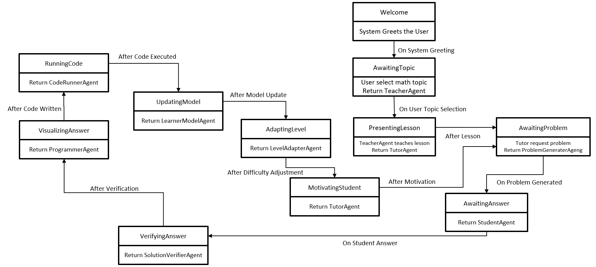
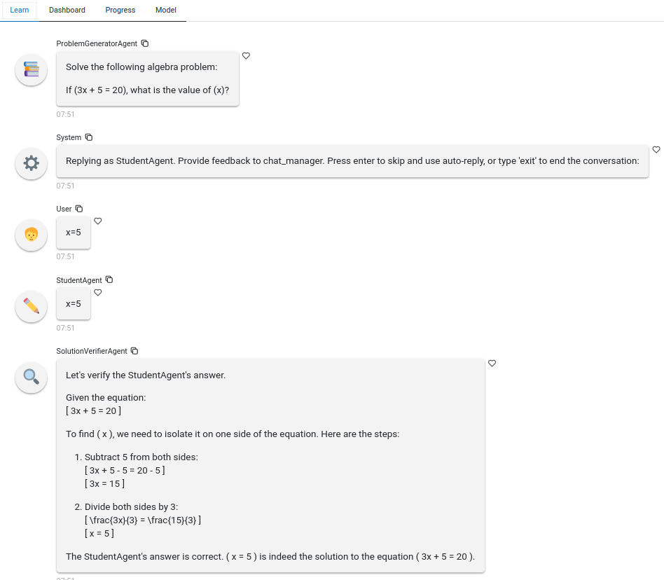
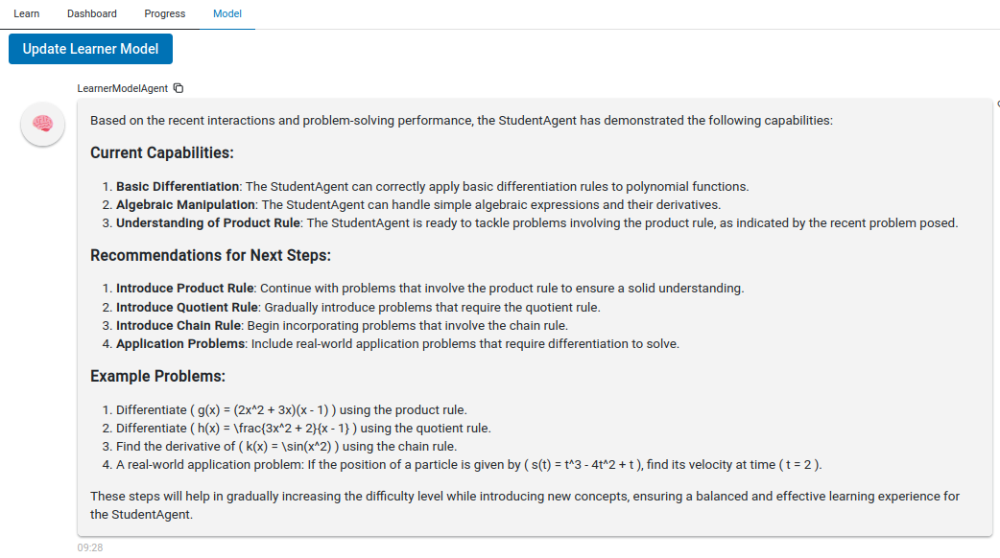

# Introduction Multi-Agent Adaptive Learning

This code is from Rivier University's Professional Seminar class (COMP-699) from the Summer of 2024.

It uses [Microsoft's autogen](https://microsoft.github.io/autogen/docs/Getting-Started/) to specialize an agent for each function of an adaptive learning system. The model used is OpenAI's ChatGPT-4o.

It uses [panel](https://panel.holoviz.org/) for the chat interface. It opens in a web browser.

There is [a paper published by the Rivier Academic Journal](https://www2.rivier.edu/journal/ROAJ-Summer-2024/J1324_Glossner%20et%20al_2024.pdf) describing the system. 

Dokku, S., Gumpula, A., Gudati, S., Nagisetty, M., Thimmarayappa, R., Yeruva, J. P., & Glossner, J. (2024). Multi-agent adaptive learning for mathematics. _Rivier Academic Journal_, 19(1), Summer 2024. Rivier University.


# Running the Code

Runs in a browser:

```sh
(adaptive) user@machine:~/Adaptive-Learning$ python -m src.UI.panel_gui_tabs
```

Runs in the console:

```sh
(adaptive) user@machine:~/Adaptive-Learning$ python -m src.UI.console_knowledge_tracer
```

## Installing Dependencies

Install Anaconda
- Download and install it from the [official Anaconda website](https://www.anaconda.com/products/individual).

```sh
conda create -n adaptive python=3.12 anaconda
conda activate adaptive
```

Install pyautogen 0.2.33+

```sh
conda config --set pip_interop_entabled True
pip install openai pyautogen
```

Note that there is also a package called autogen. Do NOT install it. You want pyautogen.

## OpenAI Environment Configuration


- LINUX: export  OPENAI_API_KEY=sk-
- WINDOWS: set  OPENAI_API_KEY=sk-

If you don't have Docker installed, you need to set AUTOGEN_USE_DOCKER=False. Be advised that if you set this to False it allows code to run on your system at whatever privileges you have (e.g., Windows Admin).

# Agents

There are 11 agents used in the adaptive learning system:

| **Agents**         | **Role**                                                                 |
|--------------------|--------------------------------------------------------------------------|
| Student            | A user proxy for a student who wants to learn mathematics.               |
| Knowledge Tracer   | Determine the Student's mathematical capabilities.                       |
| Teacher            | Present new material in multiple formats.                                |
| Tutor              | Explain answers to a Student. Help a Student to learn new material or review previous materials. |
| Problem Generator  | Generate math problems at the appropriate level for the Student.         |
| Solution Verifier  | Check the Student's solutions to math problems.                          |
| Programmer         | Write python code to solve math problem.                                 |
| Code Runner        | Execute python code and display the result.                              |
| Level Adapter      | Determine when to increase or decrease the level of difficulty for a Student. |
| Learner Model      | A model of the Student's learning level.                                 |
| Motivator          | Provides positive and encouraging feedback to the Student.               |

# Agent Communications

We had hoped to use an unconstrained `autogen.GroupChatManager` to manage agent communications. Try as we may, we could not get agents to stay within their assigned roles. We eventually resorted to a state machine for agent selection using the panel gui. The limitation of this approach means there is a very specific learning path. See the paper for details.

The console knowledge tracer program uses direct agent communication.

## State Machine in panel UI



# Panel UI

The UI contains multiple tabs in various states of completion. The Learn tab is the main interface. 



The Model tab interacts with the LearnerModel agent and provides an assessment of the student's capabilities.



