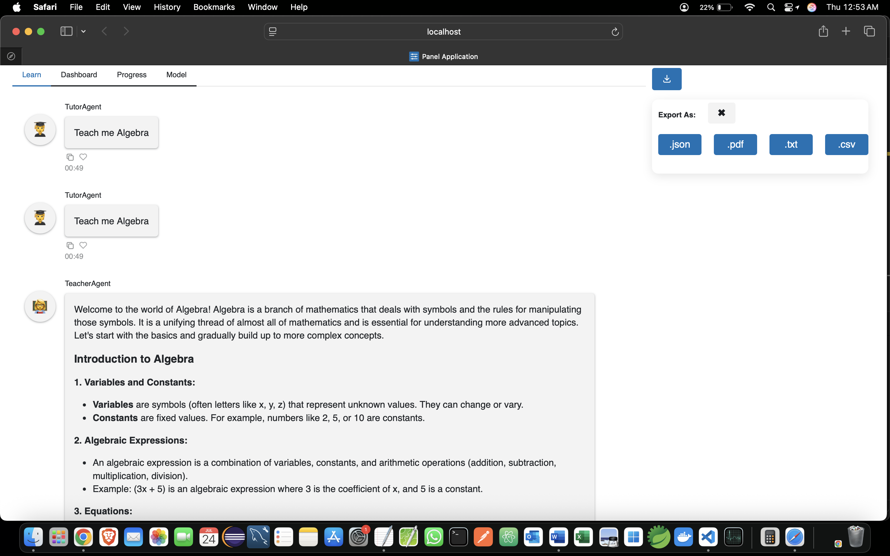

# Introduction Multi-Agent Adaptive Learning

This code is from Rivier University's Professional Seminar class (COMP-699) from the Summer of 2024, the Fall of 2024, and the Spring of 2025.

It uses [Microsoft's autogen](https://microsoft.github.io/autogen/docs/Getting-Started/) to specialize an agent for each function of an adaptive learning system. The model used is OpenAI's ChatGPT-4o.

It uses [panel](https://panel.holoviz.org/) for the chat interface. It opens in a web browser.

There is [a paper published by the Rivier Academic Journal](https://www2.rivier.edu/journal/ROAJ-Summer-2024/J1324_Glossner%20et%20al_2024.pdf) describing the system. 

Dokku, S., Gumpula, A., Gudati, S., Nagisetty, M., Thimmarayappa, R., Yeruva, J. P., & Glossner, J. (2024). Multi-agent adaptive learning for mathematics. _Rivier Academic Journal_, 19(1), Summer 2024. Rivier University.


## Executing the Code


```sh
~/Adaptive-Learning$ uv run python -m src.UI.panel_gui_tabs_jg
```


## Recommended Installation

Use a github codespace


## 

## Local Windows

### Install WSL and Ubuntu24.04

https://learn.microsoft.com/en-us/windows/wsl/install

open PowerShell in admin mode (right click on program)
`wsl --install -d Ubuntu-24.04`

To see all the available Linux distributions

`wsl --list --online`

reboot your machine


### Install Docker Desktop

https://docs.docker.com/desktop/setup/install/windows-install/

reboot 

start Docker desktop and configure it to start on Windows boot (Settings->General)


### Open Ubuntu in WSL

In Windows search, type Ubuntu and select Ubuntu-24.04

create your userid

create a password  <---- DON'T FORGET IT


### Follow the Install Linux Software Instructions

From here, the directions for Linux and Windows running Linux are the same except where noted.


# Install Linux Software (in Ubuntu or WSL Ubuntu)

`sudo apt update && sudo apt install -y \
    software-properties-common \
    curl \
    zip \
    unzip \
    tar \
    ca-certificates \
    git \
    wget \
    build-essential \
    vim \
    jq \
    firefox \  
    wslu \
    && sudo apt clean`


### Install uv and venv

https://docs.astral.sh/uv/#installation

`curl -LsSf https://astral.sh/uv/install.sh | sh`


### Install Microsoft Visual Studio Code

https://code.visualstudio.com/sha/download


### Clone the Repository

`git clone https://github.com/Rivier-Computer-Science/Adaptive-Learning.git`

cd into Adaptive-Learning and initialize a venv environment

`uv venv --python 3.12`

Activate the environment

`source .venv/bin/activate`


### Install Python requirements.txt

`uv pip install -r requirements.txt`

### Setting up Fernet Key for encryption

In your terminal, run the following Python command:

`python -c "from cryptography.fernet import Fernet; print(Fernet.generate_key().decode())"`

This will output a string .Add that key as `FERNET_KEY=` to your .env


### Steps to run migration script

To migrate existing users to Firestore and Firebase Realtime Database, use the provided migration script.

Ensure your script (e.g., migrate_firestore_users.py) points to your CSV file.

In your terminal, load the .env file after the changes are made and run then run below command:

`python migrate_firestore_users.py`

You should see output as All users migrated!! message.


### Set up the Default Browser for Windows Display

Note: Linux users should not need to perform this step.

If your Windows browser does not open automatically:

Option 1: All http requests use the Windows browser:
`sudo apt install wslu
echo 'export BROWSER=wsluview' >> ~/.bashrc`

Option 2: Only this project uses the Windows browser:

`sudo apt install wslu`

echo 'export BOKEH_BROWSER=wsluview' >> ~/.bashrc`

Option 3: Run the browser from within Ubuntu: :
`echo 'export BOKEH_BROWSER=firefox' >> ~/.bashrc`


## Set Environment Variables

Sign up to get an [OpenAI Key](https://platform.openai.com/docs/overview)

```sh
export OPENAI_API_KEY=sk-     # available form platform.openai.com
```

Note: for Windows use *set* instead of *export*


### SU25
  - Issue Link `(https://github.com/Rivier-Computer-Science/Adaptive-Learning/issues/399)`
- **Enhanced Autogen JSON Output**
  - Added structured fields: `topic`, `timestamp`, `steps_completed`, `suggestions`.
  - Improved clarity and consistency of session JSON data.

- **Firebase Firestore Integration**
  - Session data now writes to Firestore for persistent storage.
  - Includes a user migration script using CSV import format.

- **Session Replay Enhancement**
  - Restored sessions from Firebase now resume seamlessly with correct state.
  - Fixed FSM transition and agent routing bugs during replay.
  - Ensures the learning flow continues from the previous point without duplication or loss.
  - Preserves pending_problem and maintains proper chat sequence.

- **Testing and Validation**
  - This tool validates session JSON files exported from Firebase to ensure structural correctness and data integrity.
  
  - **Directory Structure**
    - `tests/test_data/` — Place input JSON files here(optional for manual testing)
    - `tests/logs/` — Validation logs are saved here
    - `tests/reports/` — JSON summary reports are saved here
    - `tests/archive/<timestamp>/` — All processed files are moved here automatically

  - **Validation Features**
    - Checks for required fields like `session_uid`, `user_uid`, `fsm_state`, `messages`, `actions`, and `suggestions`
    - Supports multiple `suggestions` formats:  
      - `agent + content` (chat style)  
      - `topic + confidence` (learning path style)  
      - `text + suggestion_id + agent + created_at` (custom app schema)
    - Logs parsing issues, missing fields, and schema mismatches
    - Generates structured summary reports

  - **Command to run the Script**
    - For more commands open the files and check the docstring
        `python src/Tools/test_firebase_session_json.py` - code run for local JSON testing
        `python src/Tools/test_firebase_user_session.py --save-json` - code run for automation testing Validate all users and save session files
        `python src/Tools/test_firebase_user_session.py --user=<USER_UID>` - Validate a specific user
        `python src/Tools/test_firebase_user_session.py --user=<USER_UID> --save-json` - Validate a specific user and save session files

- **Firebase Security Rules**
  - Check the folder Emulator-Testing/ for more info.
  - Added security rules to restrict access to user session data.
    - Users can only read/write their own `/users/<uid>/sessions/...`
    - Anonymous and cross-user writes are denied.

  **Files**
  - `firestore.rules`
  - `fetchUsers.js`, `firestore.loop.test.js`

  **Steps to Test**
  Run below commands in the terminal :
  ```bash
  firebase emulators:start
  node firestore.loop.test.js
  ```

- **Exporting Chat Session History**
  - Issue Link `(https://github.com/Rivier-Computer-Science/Adaptive-Learning/issues/460)`
  - This feature helps users to **export their full chat session history** in PDF, CSV, TXT and JSON file formats.

## How to Use the Export Feature

- Click the **Export** button.
- Choose your desired format: `.json`, `.csv`, `.txt`, or `.pdf`.
- Your chat session will download as a file containing:
    - Every chat message (with Topic, timestamp, role, and content)
    - The **lesson topic** (included via `self.topic`)

## Export Format Details
- For output docs generated check them in `Export_Docs/` folder

| Format | How Topic Is Included         | Format Structure                                   |
|--------|------------------------------|----------------------------------------------------|
| JSON   | Top-level `"topic"` field    | `{ "topic": ..., "messages": [...] }`              |
| CSV    | "topic" column, 1st row only | `topic,timestamp,role,content` (topic in 1st row)  |
| TXT    | `Topic: ...` header at top   | Human-readable transcript                          |
| PDF    | Topic heading at top         | Transcript-style document (simple text, not styled) |

## Requirements for Export
- Included in `requirements.txt` file
- [reportlab](https://pypi.org/project/reportlab/) (for PDF export)
  - Install via: `pip install reportlab`


# Agents

There are 11 agents used in the adaptive learning system:

| **Agents**         | **Role**                                                                 |
|--------------------|--------------------------------------------------------------------------|
| Student            | A user proxy for a student who wants to learn mathematics.               |
| Knowledge Tracer   | Determine the Student's mathematical capabilities.                       |
| Teacher            | Present new material in multiple formats.                                |
| Tutor              | Explain answers to a Student. Help a Student to learn new material or review previous materials. |
| Problem Generator  | Generate math problems at the appropriate level for the Student.         |
| Solution Verifier  | Check the Student's solutions to math problems.                          |
| Programmer         | Write python code to solve math problem.                                 |
| Code Runner        | Execute python code and display the result.                              |
| Level Adapter      | Determine when to increase or decrease the level of difficulty for a Student. |
| Learner Model      | A model of the Student's learning level.                                 |
| Motivator          | Provides positive and encouraging feedback to the Student.               |

# Agent Communications

We had hoped to use an unconstrained `autogen.GroupChatManager` to manage agent communications. Try as we may, we could not get agents to stay within their assigned roles. We eventually resorted to a state machine for agent selection using the panel gui. The limitation of this approach means there is a very specific learning path. See the paper for details.

The console knowledge tracer program uses direct agent communication.

## State Machine in panel UI


# Panel UI

The UI contains multiple tabs in various states of completion. The Learn tab is the main interface. 


The Model tab interacts with the LearnerModel agent and provides an assessment of the student's capabilities.


Export icon added to the UI for chat export feature
